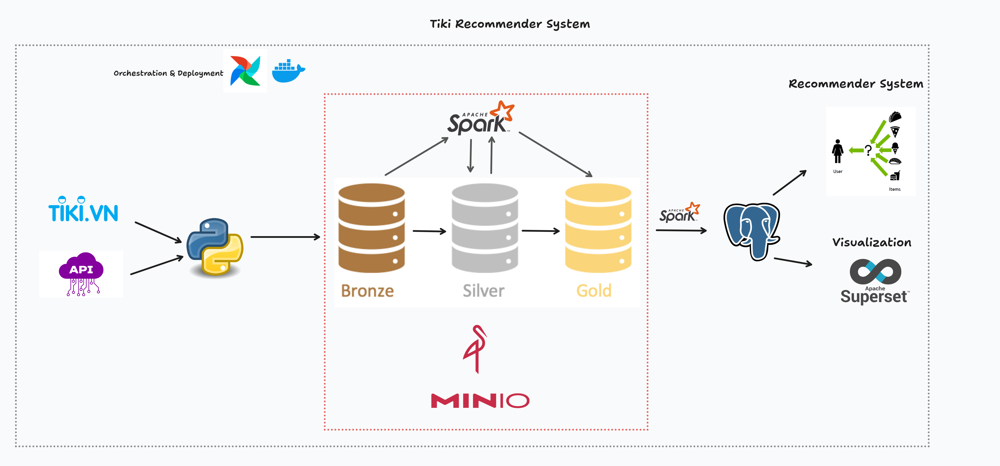
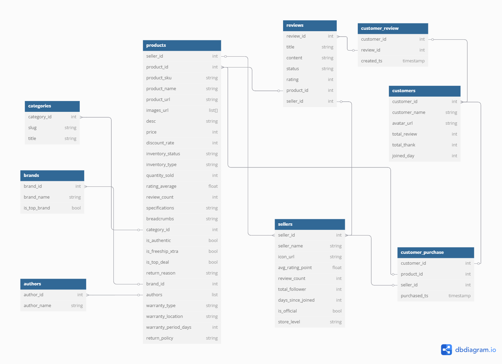

# Tiki Data Pipeline for Recommender System

## Introduction

This project implements a complete ETL (Extract - Transform - Load) pipeline to collect data from the Tiki.vn website, process it through Bronze, Silver, and Gold data layers by MinIO, and finally load it into PostgreSQL. The ultimate goal is to serve a product recommender system via an API and provide data visualizations using Apache Superset.

The pipeline is orchestrated using Apache Airflow and leverages Apache Spark for complex data transformations.

## Architecture & Data Flow

The overall data flow is as follows:

1.  **Extract (Bronze Layer):**
    * Data is crawled from the Tiki.vn website, starting with `categories` information.
    * For each category, details of individual `products` are crawled, including associated `reviews` and `seller` information.
    * Raw data (presumably JSON format) is stored in MinIO under the path `warehouse/bronze/tiki/`.

2.  **Transform (Silver Layer):**
    * Raw data from the Bronze layer is read and processed using Spark (PySpark).
    * Basic cleaning, data type standardization, and initial transformations are performed.
    * The results are stored in MinIO as Parquet files, organized into 4 main folders corresponding to the primary entities: `categories`, `sellers`, `products`, `reviews` under the path `warehouse/silver/tiki/`.

3.  **Transform (Gold Layer):**
    * Data from the Silver layer (Parquet) is read and further transformed using Spark.
    * Data is restructured into analytical data models suitable for analysis and the recommender system. This stage generates 9 primary tables (entities) based on the designed ERD:
        * `gold_categories`
        * `gold_brands`
        * `gold_authors`
        * `gold_sellers`
        * `gold_users` (formerly `customers`)
        * `gold_products` (Main fact table)
        * `gold_reviews`
        * `gold_images_url` (Table containing product image URLs)
        * `gold_products_authors` (Mapping table for products and authors)
        * `gold_customer_purchase` (Table might require a separate data source or extraction logic)
    * The Gold layer data is initially saved as Parquet files in MinIO at `warehouse/gold/tiki/`.

4.  **Load (Data Warehouse):**
    * Data from the Gold layer Parquet files in MinIO is loaded into a PostgreSQL database (database `tiki_recommender` on the `de_psql` service).
    * The tables in PostgreSQL mirror the structure of the 9 Gold layer entities.

5.  **Application (Future):**
    * Data in PostgreSQL will be consumed by an API (built with FastAPI or another framework) to serve product recommendations.
    * Data will also be connected to Apache Superset to build visualization dashboards.

## Technology Stack

* **Orchestration:** Apache Airflow
* **Data Processing:** Apache Spark (PySpark)
* **Data Lake Storage:** MinIO (S3 Compatible)
* **Data Warehouse:** PostgreSQL
* **Infrastructure:** Docker, Docker Compose
* **Crawling:** Python (requests, BeautifulSoup, Scrapy, pandas, tqdm)
* **API (Future):** FastAPI / Flask / Django (Planned)
* **Dashboard (Future):** Apache Superset

## Data Architenture


## Class Diagram


## Project Structure
```
.
├── assets/
│   ├── class-diagram.png
|   └── architecture.png
│
├── config/
│   └── settings.py
│
├── dags/
│   ├── extract/
│   │   ├── extract.py
│   │   ├── minio_manager.py
│   │   ├── tiki_crawler.py
│   │   └── utils.py
│   │
│   ├── load/
│   │   ├── load.py
│   │   └── postgres_handler.py
│   │
│   ├── transform/
│   │   ├── spark_manager.py
│   │   ├── tiki_transformer.py
│   │   └── transform.py
│   │
│   └── tiki_etl_pipeline.py
│
├── data/                                # Data files directory (if any)
│
├── docker/
│   └── airflow/
│       └── Dockerfile
│                             
├── logs/                                # Airflow logs
├── mnt/                                 # Mount volumes (if any)
│
├── plugins/                             # Custom Airflow plugins
│
├── src/
│   ├── data/
│   └── utils/
│       └── logger.py
│
├── tests/
│   └── test_etl.py
│
├── .gitignore
├── create_table.sql
├── docker-compose.yaml
├── init.sql
├── env
├── requirements.txt
└── README.md

```


## Setup and Running the Project

1.  **Prerequisites:**
    * Docker
    * Docker Compose
2.  **Configuration:**
    * Copy the `.env.example` file (if provided) to `.env`.
    * Fill in the necessary environment variables in `.env`, especially:
        * `MINIO_ROOT_USER` (e.g., `minio`)
        * `MINIO_ROOT_PASSWORD` (e.g., `minio123`)
        * Other variables if needed (Database password, etc.).
    * Configure paths, bucket names, etc., in `src/config/settings.py` if necessary (although reading from `.env` is preferred).
3.  **Build and Run Containers:**
    ```bash
    docker-compose up --build -d
    ```
    *(The `--build` flag is needed for the first run or when you modify Dockerfiles/requirements.txt)*
4.  **Initialize Database (If needed):**
    * Ensure the tables in the target PostgreSQL database (`tiki_recommender`) are created. You can run the SQL script from `init.sql` (if using that method) or run the `create_postgres_tables` task in Airflow (if you created one).
5.  **Setup Airflow Connection:**
    * Access the Airflow UI (`http://localhost:8080`).
    * Navigate to **Admin -> Connections**.
    * Create/Verify the `postgres_default` connection points to the `de_psql` service with the correct credentials and the initial database set to `airflow` (or `postgres`).
    * (Optional) Create a `postgres_tiki_recommender` connection pointing specifically to the `tiki_recommender` database if your loading tasks require it.

## Usage

1.  **Access Airflow UI:** Open your browser to `http://localhost:8080` (login with `admin`/`admin` if unchanged).
2.  **Enable and Trigger DAG:**
    * Find the DAG with the ID `tiki_full_etl_and_load` (or the name you set).
    * Toggle the switch to "Unpause" the DAG.
    * Click the "Play" button (Trigger DAG) to run the pipeline manually for the first time, or wait for the defined `schedule_interval`.
3.  **Monitor Pipeline:** Observe the task progress in the Grid View or Graph View. Check the logs for each task if errors occur.
4.  **Access Other Services:**
    * **MinIO Console:** `http://localhost:9001` (Log in with credentials from `.env`) to view Bronze, Silver, and Gold layer data.
    * **pgAdmin / PostgreSQL Client:** Connect to `localhost:5433` (or the host port you mapped) with user/pass `airflow`/`airflow` to view data in the `tiki_recommender` database.
    * **Superset (Future):** `http://localhost:<superset_port>`
    * **API (Future):** `http://localhost:<api_port>`

## Future Work (TODO)

* [ ] Build the product recommendation model.
* [ ] Develop an API to serve recommendation results.
* [ ] Integrate Apache Superset and build analytical dashboards.
* [ ] Optimize Spark jobs (partitioning, caching, resource allocation).
* [ ] Implement incremental loading mechanisms for efficiency instead of daily full runs.
* [ ] Add monitoring and alerting for the pipeline.
* [ ] Write unit and integration tests.
* [ ] Improve error handling and task retry strategies.
